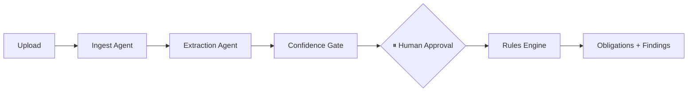

# Bridgeline

**The IEP operations layer.** Bridgeline doesn't write IEPs — it makes finalized ones actually happen in classrooms.

An IEP (Individualized Education Program) is a legally binding federal document specifying the accommodations a student with a disability must receive. Federal law — 34 CFR §300.323(d) — requires every teacher responsible for implementing one to have access to it and be informed of their specific duties. In practice this fails constantly: accommodations get filed and forgotten, teachers never see the document that governs their classroom, and nobody notices until it's too late.

Bridgeline ingests a finalized IEP (even a bad scan), extracts it with source-grounded evidence, routes anything uncertain to a human for approval, derives every teacher's legal obligations through a deterministic rules engine cited against the actual federal regulation, and tracks whether those obligations were actually confirmed.

*Every student in this project is synthetic. No real student data exists anywhere in this repository.*

---

## Quickstart

**Hosted (60 seconds):**
1. Open **[URL]**
2. Click **"Sign in as Priya (Case Manager)"** — no password needed
3. Click **"Inspect a completed run"** to see a full pipeline instantly, or upload a document from `data/synthetic/documents/` to watch one run live

**Local (5 minutes):**
```bash
git clone https://github.com/rahulgunwanistudy-2005/BridgeLine.git
cd BridgeLine
cp .env.example .env      # add your GOOGLE_API_KEY (see note below)
docker compose up
```
Wait for the healthcheck to pass, then visit `localhost:3000`.

---

## Break me

We invite this. Each of these has been verified to behave correctly:

- Upload a random non-IEP PDF — rejected cleanly, never hallucinated into a fake record
- Refresh the page mid-pipeline-run — the stream resumes exactly where it left off, nothing lost
- Kill your network mid-run — the run surfaces a clear system failure, never a silent corruption
- Upload the same IEP twice — identity reconciliation catches it
- Sign in as the teacher account and try to reach case-manager data — blocked

---

## Architecture



- **Ingest → Extract → ConfidenceGate**: OCR and structured extraction. Every accommodation, service, and goal carries `source_page`, `source_quote`, and `confidence`. Nothing below threshold is silently accepted — it's flagged for human review.
- **⏸ Human Approval**: the pipeline parks. A case manager reviews the extracted record — the exact source text highlighted on the scanned page — and approves or edits it. This is human-in-the-loop, not decoration: the LLM never has authority to finalize a legal record.
- **Rules Engine**: derives obligations from the approved record. **Zero LLM calls in this module** — it's pure, deterministic Python, and an automated test asserts the module structurally cannot import the LLM gateway. Ten rules, each carrying its exact federal citation, generated into `apps/api/bridgeline/rules/RULES.md` and verified against the live text of 34 CFR at Cornell LII / eCFR.

Full data shapes: `packages/schemas/`. Full rule citations: `apps/api/bridgeline/rules/RULES.md`.

---

## Where and how we used Codex + GPT-5.6

This entire project was built with Codex. What follows is specific, not a blanket claim — three real examples of where it did more than autocomplete.

### The rules engine was designed from a specification, not a bug to fix
We wrote `references/idea-citations.md` ourselves — ten rules, each with its exact federal citation pulled from live regulation text, plus a plain-English statement of what each one requires. We handed that specification to Codex and asked for a deterministic derivation engine. It came back with:
- a rule registry where every rule declares its own citation, so the documentation is generated from the code and can never drift from it
- property-based tests (Hypothesis) asserting that deriving obligations from identical input twice produces byte-identical output — we didn't ask for this explicitly; it understood why determinism mattered for a system whose output has legal weight
- a structural test that parses the module's own AST and fails the build if anyone ever adds an LLM import to the rules package — turning "the rules engine never calls the model" from a comment into something CI enforces

### It designed the contract that let two people build in parallel without collision
We split the build across a backend session and a frontend session running at the same time. Codex designed the six JSON Schema contracts (`packages/schemas/`) that both sides code against — every field required or explicitly nullable, every field documented, generating Pydantic models on one side and TypeScript types on the other via a codegen script. When the backend schema changed mid-build, the frontend's type check failed immediately instead of breaking silently at runtime a day later.

### It caught a bug our own tests missed, and it refused an instruction when it should
During the service-minute accounting work, a Codex-authored property test surfaced an off-by-one in how partial weeks were counted across a school holiday boundary — something our own hand-written tests hadn't covered. Separately, when asked to register a legal citation into the rules engine, it refused, because the source citation file still carried an "unverified" marker — the same discipline the codebase enforces everywhere else, applied by the tool building it.

### One honest note on the runtime model
Codex on GPT-5.6 built the entire system — every file, every test, every schema. The **runtime inference calls in the shipped app** currently go to Gemini, because we ran out of API budget partway through the hackathon window and needed a free tier to keep building and testing. The LLM gateway (`apps/api/bridgeline/llm/client.py`) is a single module with the model pinned in exactly one place — swapping it back to GPT-5.6 is a configuration change, not an architecture change. We're stating this plainly rather than leaving it to be discovered.

---

## Validation

We didn't just claim this works — we measured it. `harness/RESULTS.md` (regenerate with `python -m harness all`) reports:

- **Rules suite**: obligation derivation checked against hand-audited expected output for every ground-truth student, cross-verified against the actual regulation text and roster data — not just checked for internal consistency. Byte-identical determinism confirmed across repeated runs.
- **Acceptance suite**: the three scripted findings (a progress-conflict, a 3-of-6 confirmation gap, a service-minute shortfall) verified against real seeded data.
- **Extraction suite**: field-level accuracy across clean, degraded, and hand-scanned documents, reported by tier. The headline metric is **silent-wrong-rate** — fields the model got wrong *and* marked high-confidence — not raw accuracy. A wrong answer that gets flagged is the safety architecture working. A wrong answer stated confidently is the failure we designed against.

---

## Known limitations

- **Brief generation** (per-teacher action briefs) is architected but demoed against representative data behind an environment flag, not live generation — this was a scope cut under hackathon time constraints, not an oversight.
- **Runtime model is currently Gemini**, not GPT-5.6, for the budget reason stated above.
- This is **not** a certified FERPA-compliant system. It's built with data minimization and audit-trail principles in mind, and every example in this repository is synthetic, but real deployment would require a full compliance review before touching a single real student record.

---

## Synthetic data statement

The "Riverside Demo School District" — every student, teacher, IEP, and document in this repository — is entirely fictional, generated for this project. `data/synthetic/PROVENANCE.md` documents exactly how it was produced. No real student, no real district, no real IEP appears anywhere in this codebase.

---

## License

MIT.